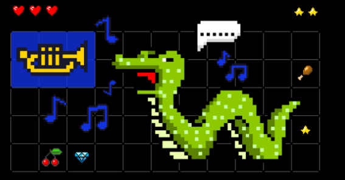
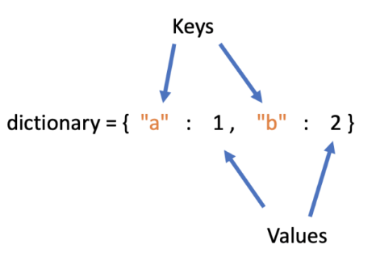

# __Python-homeworks__
___
1. Install a development environment or PyCharm or VSCode
2. Explore PEP-8
___
[Code guide Python](https://pythonworld.ru/osnovy/pep-8-rukovodstvo-po-napisaniyu-koda-na-python.html)

___
3. Print a List of Python Reserved Words.

    3.1. Run this print.

___
__import keyword__

__keyword.iskeyword('break')__

__True__

__print(keyword.kwlist)__
___
4. Print Zen Python. Run this print.

___import this___

___

5. ___Create profile on Github___

    5.1 Create repository (remote and clone locally)

    5.2 Create a new branch, make any change in it and add it to git

   5.3 Create a pull request

___

6. Create a Python module to implement integer keyboard input.

    6.1 Add functionality to convert to float and str. Print the result.
___
7. Create a Python module to implement keyboard entry of fractional (with floating comma) values.

   7.1 Add functionality to convert to int and str.

   7.2 Print the result.

___
## Task #1 

From two random numbers, one of which is even, and the other is odd, determine and display an odd number.
___

## Task #2 

Three different numbers are entered. Find which one is the average (greater than one, but less than the other).

___

## Task #3 

The coordinates (x;y) of the point and the radius of the circle (r) are entered. Determine whether a given point belongs to a circle if its center is at the origin.
___

## Task #4 

Given the following function y=f(x):

___y=2x-10, if x>0___

___y = 0, if x = 0___

___y = 2 * |x| - 1, if x < 0___

It is required to find the value of the function given x.
___

## Task #5 

Three integers are entered. Determine which one is the largest.
___

## Task #6 

Based on the lengths of three segments entered by the user, determine the possibility of the existence of a triangle composed of these segments. If such a triangle exists, then determine whether it is different-sided, isosceles or equilateral.
___

## Task #7 

Determine the quarter of the coordinate plane to which the point belongs. Enter point coordinates from the keyboard.

___

## Task #8 

Two integers are entered. Check if the first is divisible by the second. Display a message about it, as well as the remainder (if any) and the quotient (in any case).

___

## Task #9 

Find the roots of a quadratic equation and display them on the screen, if any. If there are no roots, then display a message about it. A specific quadratic equation is determined by the coefficients a, b, c that the user enters.

___

## Task #10 

[links for w3schools.com](https://www.w3schools.com/python/python_strings_methods.asp)

According to the given snare, consider and test all string methods. For each method, the code should contain your own examples. Homework Outcome: Python files with modified methods.
___

## Task #11 

[Python While Loops](https://www.w3schools.com/python/python_while_loops.asp)

Some list A containing integers is given. Develop a program that calculates the sum of the elements of a list.

___

## Task #12 

[Python String Methods](https://www.w3schools.com/python/python_ref_string.asp)

Given a list of strings. In each line, count the number of occurrences of the given character.
___

## Task #13 

The user enters a number. Determination of the presence of a given element in the list list_=[2,8,3,4,3,5,2,1,0,3,4,4,5,8,7,7,5]. If the element is not found, then an appropriate message is displayed.
___

## Task #14 

Fill the list with one hundred zeros, except for the first and last elements, which must be equal to ones.

___

## Task #15 

Form an ascending list of even numbers (the number of elements is 45).

___

## Task #16 

The user enters a number. Determine if the list contains the given number x. Display informational message contains or does not contain.

___

## Task #17 

Find the sum and product of the elements of the list. Display the results on the screen.

___

## Task #18 

Formation of a random array of 15 numbers that are in the range from 1 to 100.

___

## Task #19 

Find the largest element in the list and display it on the screen.

___

## Task #20 

Determine if there are duplicate elements in the list, if so, display this value on the screen.

___

## Task #21 

Swap the largest and smallest elements of the list.

___

## Task #22 

Given an arbitrary list. Imagine it in reverse order!

___

## Task #23 

Create a dictionary with at least 5 elements. Swap the first and last element of the object. Delete the second element. Add the key 'new_key' to the end with the value 'new_value'. Print out the final dictionary. It is important that the dictionary remains the same (has the same address in memory).

[Python Dictionaries](https://www.w3schools.com/python/python_dictionaries.asp)

---
